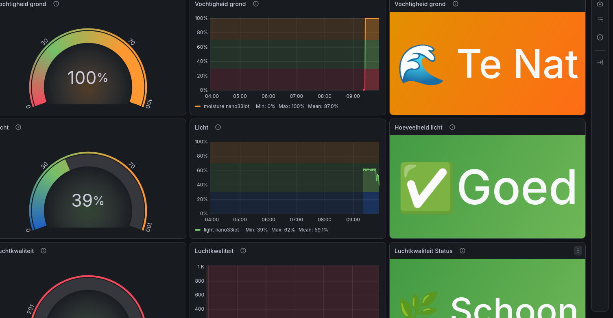

# Greenhouse Monitor

<!--

-->

## About

Greenhouse Monitor is an IoT project built to monitor environmental conditions inside a greenhouse.

Version 1 focuses on building a reliable foundation. Sensor data is collected by a WiFi-enabled Arduino board, sent to InfluxDB using the HTTP API, visualized in Grafana, and the grow light can be controlled through MQTT.

Future versions will introduce an M5Stack controller as the central controller of the greenhouse, while the Arduino becomes a dedicated sensor and actuator node.

---

## Features

* Soil moisture monitoring
* Light sensor
* Air quality sensor
* WiFi connectivity
* HTTP communication with InfluxDB
* Grafana dashboard
* MQTT light control
* NeoPixel status LEDs
* Grow light control

---

## Hardware

The reference implementation was developed using:

* Arduino Nano 33 IoT
* Soil moisture sensor
* Light sensor
* Air quality sensor
* NeoPixel LED strip

The software is intended to be portable to other WiFi-enabled Arduino-compatible boards with minimal changes.

---

## Software

* Arduino IDE
* InfluxDB
* Grafana
* MQTT Broker (Mosquitto)
* telegraf

---

## Project Structure

```text
greenhouse/

main.ino
constants.*
leds.*
sensors.*
wifi_conn.*
mqtt.*
influx_conn.*
secrets.h
```

---

## Required Libraries

Install the following Arduino libraries before compiling:

* WiFiNINA
* PubSubClient
* ArduinoHttpClient
* InfluxDB Client for Arduino
* Adafruit NeoPixel

---

## Installation

1. Clone this repository.
2. Open the project in the Arduino IDE.
3. Install all required libraries.
4. Create a `secrets.h` file.
5. Fill in your WiFi and InfluxDB credentials.
6. Compile and upload the project.

---

## Configuration

Create a file named `secrets.h`:

```cpp
#define SECRET_SSID     "your_wifi"
#define SECRET_PASS     "your_password"

#define SECRET_ORG      "your_org"
#define SECRET_BUCKET   "your_bucket"
#define SECRET_TOKEN    "your_token"
```

---

## MQTT

The grow light can be controlled through MQTT.

### Topic

```text
greenhouse/light
```

### Supported payloads

```text
ON
OFF
```

The MQTT functionality was tested using MQTT Explorer.

---

## Dashboard

The Grafana dashboard visualizes all sensor measurements stored in InfluxDB.





---

## Roadmap

### Version 1

* Sensor monitoring
* WiFi connectivity
* HTTP communication with InfluxDB
* Grafana dashboard
* MQTT light control
* NeoPixel status LEDs

### Future Versions

* M5Stack controller
* Pump control
* Automatic irrigation
* Local decision making
* Configurable settings
* Improved dashboard

---

## Acknowledgements

Special thanks to the Arduino and open-source communities for providing the libraries and documentation that made this project possible.

---

## License

This project is released under the MIT License.
